# sugarconsolejs

A simple collection of extensions to the console object to give you some sugar

## How to use

### npm

`npm install sugarconsole --save-dev`

### bower

`bower install sugarconsole --save`

### [Download project](https://github.com/lmfresneda/sugarconsolejs/archive/master.zip "Download project")

Menction our webpage at the script 

```html
	<script type="text/javascript" src="dist/sugarconsole.min.js"></script>
```

Extensions can be used directly from the global `console` object or by using the available `sugarconsole` class.

## Requirements

SugarConsole.js is zero dependencies. It is only necessary that the global object `console` exists.

## API

### .separator(*[size = 80, fontSize = 1]*)

Paint a line separator.

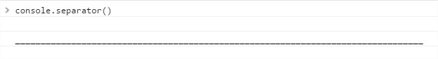

We can indicate that it is shorter or longer using the `size` parameter and its thickness using the `fontSize` parameter, eg:

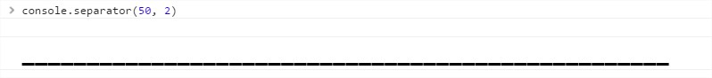

### .sugar(msg *[, fontSize = 1.2]*)

Paint the text in a sugary way.

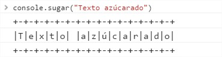

Using the optional parameter `fontSize` we can make the text more or less large, eg:

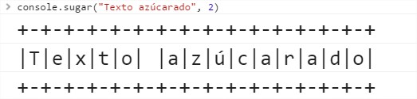

### .xinfo(*[msg = "Empty Info text", infoObject = ""]*)

Paint an INFO text

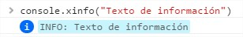

We can optionally pass you an object that will be logged after the text, eg:

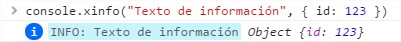

### .xerror(*[msg = "Empty Error text", errorObject = ""]*)

Paint an ERROR text

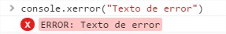

We can optionally pass you an object that will be logged after the text, eg:

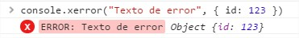

### .xwarn(*[msg = "Empty Warning text", warnObject = ""]*)

Paint a WARNING text 

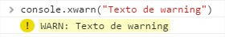

We can optionally pass you an object that will be logged after the text, eg:

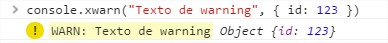

### .xdebug(*[msg = "Empty Debug text", debugObject = ""]*)

Paint a DEBUG text


We can optionally pass you an object that will be logged after the text, eg:

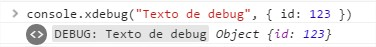

### .xlog(*[msg = "Empty Log text", fontSize = 1.2, fontFamily = "Arial"]*)

Paint a simple log text.

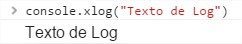

Optionally we can indicate the font size and typography, eg:

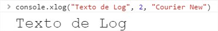

### .fontFamily(font)

With this method we can change the default typography when doing console.xlog

### .object(...)

Is console.log

### .strong(*[msg = "Empty bold text", fontSize = 1.2]*)

Paint a bold text.

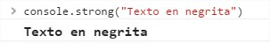

Optionally we can indicate the font size using the parameter `fontSize`.

### .italic(*[msg = "Empty italic text", fontSize = 1.2]*)

Paint an italic text.


Optionally we can indicate the font size using the parameter `fontSize`.

### .quote(*[msg = "Empty quote text", fontSize = 1.2]*)

Paint a quoted text.

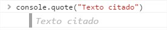

Optionally we can indicate the font size using the parameter `fontSize`.

### .now(*[fontSize = 1.2]*)

Paint the current date. If this method was previously called, the difference with the previous date in milliseconds will also be painted.

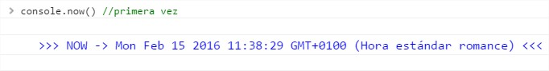

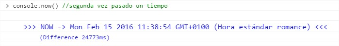

### .step(*[reset = true]*)

With this method we can paint steps (the typical "Here step") in a slightly more elegant way.This method concretely paints the next step.We can indicate if you reset the steps or not.

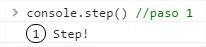 

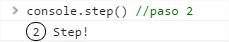


If they pass more than 5 seconds between one step and another, they will automatically reset:


But we can force it not to do so using the `reset` parameter by passing it as `false`:

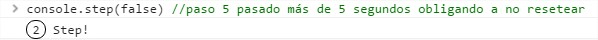

### .resetSteps()

Reset steps

### .stepNoReset()

Paint directly the next step without resetting even after 5 seconds. Same as doing `.step(false)`.

### .stepWithReset()

Paint a step by forcing it to reset. Same as doing:

```javascript
	console.resetSteps();
	console.step();
```

## Extra

We can also find things of no importance and/or that are of no use:

### .testlog()

Method to test that the extension has run:


### .logo()

This method simply paints the logo of SugarConsole.js

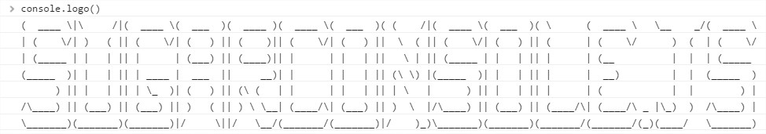
